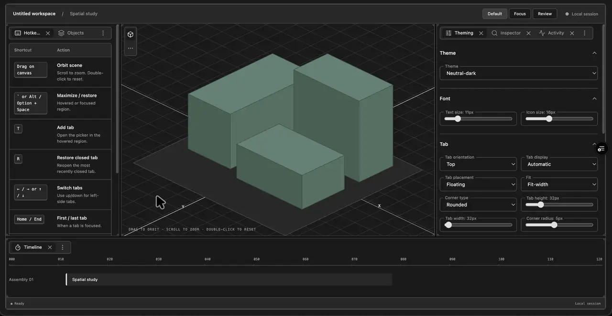

# Demo screenshots

Screenshots of the [vanilla demo](https://quilt-layouts.vercel.app/vanilla.html). The [React demo](https://quilt-layouts.vercel.app/react.html) uses the same layout engine and chrome.

## Recorded walkthrough



A 35-second recording of the demo in use, converted to a looping animated WebP at 1280 pixels wide.

## Resizing

**Before:** the default workspace with objects, scene, settings, and timeline.


**After:** more room for settings and a taller timeline, using the same panes.


Dividers also support keyboard resizing: focus a divider and use the arrow keys; hold Shift for larger steps. See the demo's Hotkeys tab for the full interaction guide.

## Light theme and vertical tabs


The Focus preset gives the scene most of the workspace and collects supporting panes in a sidebar. This capture uses **Neutral-light**, **Vertical** orientation, **Compact** display, and **Floating / Fit-width / Capsule** tabs.

## Sage theme and review layout


The Review preset separates the timeline, inspector, and settings. This capture uses **Sage**, **Automatic** tab display, and **Anchored / Angle** tabs. Individual groups can retain their own orientation, as the scene does here.

## Configuration controls

The **Theming** tab contains these controls:

| Control        | What it changes                                                                          |
| -------------- | ---------------------------------------------------------------------------------------- |
| Theme          | Preset colors, including light and dark theme families                                   |
| Font           | Text and icon sizes                                                                      |
| Tab            | Orientation, compact display, floating or anchored placement, fit, shape, and dimensions |
| Resizing       | Divider width, auto-collapse behavior, and visibility of disabled handles                |
| Corner handles | Shape, visibility, color, size, inset, stroke width, and opacity                         |
| Layout JSON    | Inspect and edit layout and appearance settings                                          |

Use **Default**, **Focus**, and **Review** in the workspace toolbar to switch layouts. Applications can configure these features through the public API; see [theming](theming.md) and [API documentation](api.md).

## Refreshing these captures

Install the repository dependencies and Playwright Chromium.

```sh
npm ci
npx playwright install chromium
npm run build
npm run dev -- --port 5298 --strictPort
```

In another terminal at the repository root:

```sh
node scripts/capture-demos.mjs
```

The script uses a fresh browser session, clicks the demo controls, drags real dividers, and writes four PNGs into `docs/media`. `DEMO_URL` can override the local server URL. Screenshots use a 1280 × 820 viewport.

The separate `demo-walkthrough.webp` was converted from a video recording; the capture script does not regenerate it.
