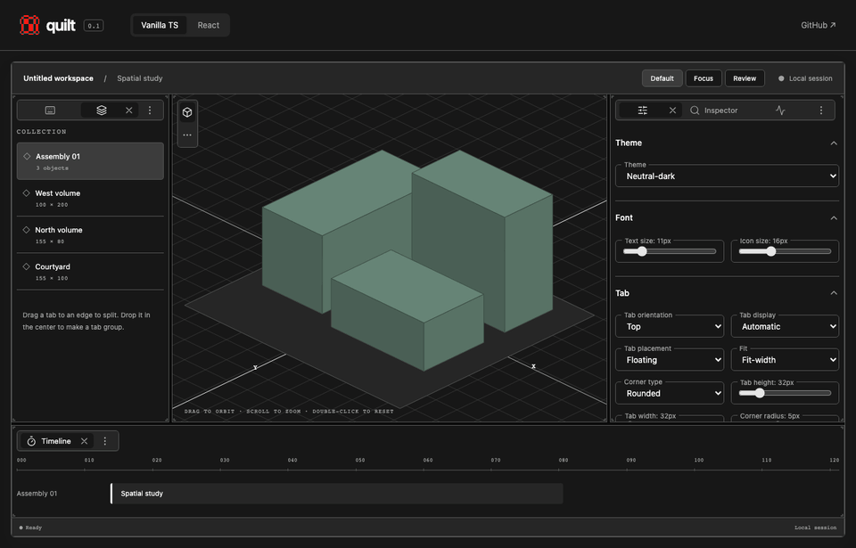
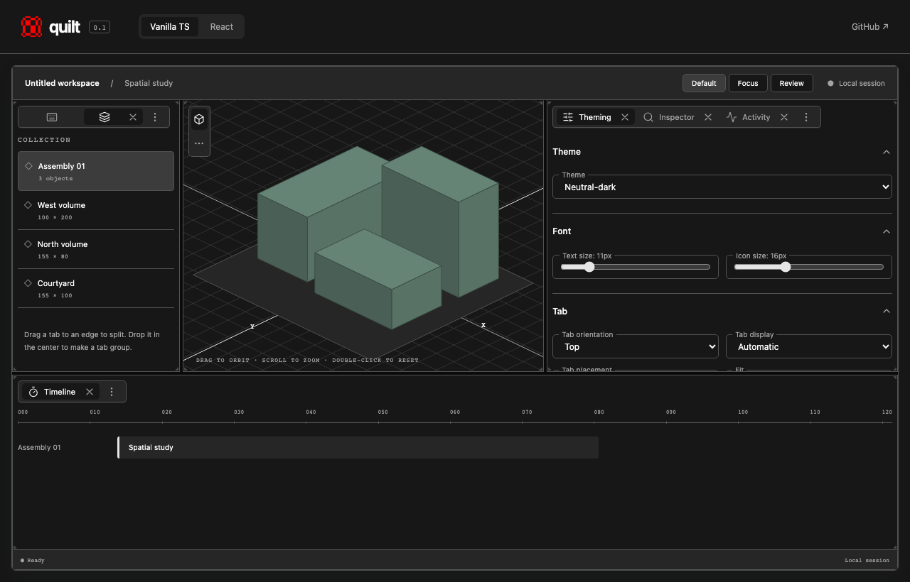
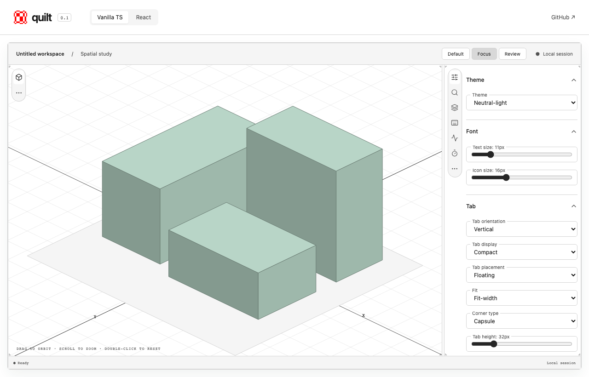
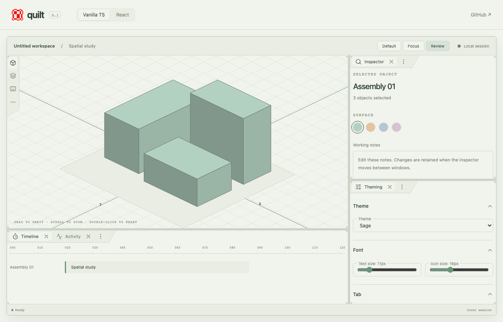

# Quilt in pictures

These are captures of the working vanilla demo. The [React demo](https://layouts-ruddy.vercel.app/react.html) uses the same layout engine and chrome. Try the controls yourself in the [live vanilla demo](https://layouts-ruddy.vercel.app/vanilla.html).

## Resizing



The recording widens the settings pane, increases the timeline height, then returns both dividers to their starting positions. Pane contents remain mounted during resizing; the toolbar and status bar keep their fixed sizes.

**Before:** the default workspace with objects, scene, settings, and timeline.


**After:** more room for settings and a taller timeline, using the same panes.



Dividers also support keyboard resizing: focus a divider and use the arrow keys; hold Shift for larger steps. See the demo's Hotkeys tab for the full interaction guide.

## Light theme and vertical tabs



The Focus preset gives the scene most of the workspace and collects supporting panes in a sidebar. This capture uses **Neutral-light**, **Vertical** orientation, **Compact** display, and **Floating / Fit-width / Capsule** tabs.

## Sage theme and review layout



The Review preset separates the timeline, inspector, and settings. This capture uses **Sage**, **Automatic** tab display, and **Anchored / Angle** tabs. Individual groups can retain their own orientation, as the scene does here.

## Configuration controls

Open the **Theming** tab to explore:

| Control        | What it changes                                                                          |
| -------------- | ---------------------------------------------------------------------------------------- |
| Theme          | Preset colors, including light and dark theme families                                   |
| Font           | Text and icon sizes                                                                      |
| Tab            | Orientation, compact display, floating or anchored placement, fit, shape, and dimensions |
| Resizing       | Divider width, auto-collapse behavior, and visibility of disabled handles                |
| Corner handles | Shape, visibility, color, size, inset, stroke width, and opacity                         |
| Layout JSON    | Inspect and edit the workspace structure                                                 |

Use **Default**, **Focus**, and **Review** in the workspace toolbar to switch layouts. Applications can configure these features through the public API; see [theming](theming.md) and [API documentation](api.md).

## Refreshing these captures

Install the repository dependencies and Playwright Chromium. The GIF encoder also needs `ffmpeg` on your PATH.

```sh
npm ci
npx playwright install chromium
npm run build
npm run dev -- --port 5298 --strictPort
```

In another terminal at the repository root:

```sh
node scripts/capture-demos.mjs
```

The script uses a fresh browser session, clicks the demo controls, drags real dividers, and writes four PNGs plus a looping GIF into `docs/media`. `DEMO_URL` can override the local server URL. Screenshots use a 1280 × 820 viewport; the GIF is reduced to 960 pixels wide for the README. The images are captured UI, not mockups.
